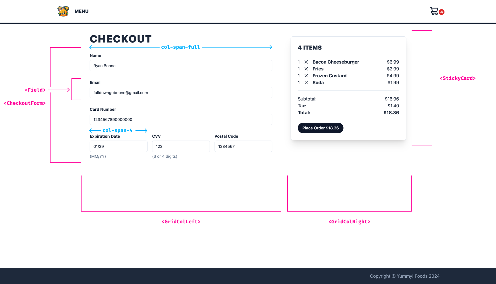

# Exercise 25: Build Checkout

We're almost ready to ship our app, but we have one crucial thing left: we need to build our checkout page!

We need to build the page out of components our team has prepared for us, as well as wire up the checkout submission to our order submission service.

## Examine the design

We've been given a design of the page, and the page elements have been graciously mapped to components our team has built. Examine these designs and locate all of the mapped components in the project.

Here's where you'll find all the components necessary to complete this exercise:

- [`src/lib/ui/separator.tsx`](./src/lib/ui/separator.tsx)
  - `Separator`
- [`src/lib/shared-components/field.tsx`](./src/lib/shared-components/field.tsx)
  - `Field`
  - `FieldLabel`
  - `FieldInput`
  - `FieldDescription`
- [`src/lib/shared-components/sticky-card.tsx`](./src/lib/shared-components/sticky-card.tsx)
  - `StickyCard`
  - `StickyCardHeader`
  - `StickyCardHeading`
  - `StickyCardContent`
  - `StickyCardFooter`
- [`src/lib/shared-components/summary.tsx`](./src/lib/shared-components/summary.tsx)
  - `Summary`
  - `SummaryItem`
- [`src/lib/checkout/line-items.jsx`](./src/lib/checkout/line-items.jsx)
  - `LineItems`
  - `LinteItem`
- [`src/lib/checkout/checkout-form.jsx`](./src/lib/checkout/checkout-form.jsx)
  - `CheckoutForm`
  - `CheckoutFormSubmit`

Additionally, here are some utilities that will be useful:

- [`pluralize`](./src/lib/pluralize.ts)
- [`useCart`](./src/lib/cart-context/use-cart.js)
- [`formatMoney`](./src/lib/format-money.ts)
- [`useMutation`](./src/lib/use-mutation.ts)
- [`postOrder`](./src/lib/checkout/post-order.ts)
- [`serializeFormData`](./src/lib/serialize-form-data.ts)

## Add the checkout page

- [`src/app.exercise.jsx`](./src/app.exercise.jsx)
- [`src/screens/checkout.exercise.jsx`](./src/screens/checkout.exercise.jsx)

1. In [`src/app.exercise.jsx`](./src/app.exercise.jsx), add a checkout route to our router. Use the path `/checkout`.
2. In [`src/screens/checkout.exercise.jsx`](./src/screens/checkout.exercise.jsx), build out the `Checkout` page component as designed (the page title and main layout grid have already been added).
3. Add the cart's `itemCount` to the sticky card heading, and show either `Item` or `Items` depending on the count (hint: `pluralize` is your friend).
4. Add the cart's `items` as line items.
5. Add the cart's `subtotal`, `tax` and `total` to the summary section. Make sure to bold the total. Don't forget to format these values as money.
6. While you're at it, add the order's `total` to the checkout form submit button.

At this point, you should have presentable data. Refer to the images above to make sure everything is styled appropriately.

## Wire up checkout submission

- [`src/screens/checkout.exercise.jsx`](./src/screens/checkout.exercise.jsx)

1. Still in [`src/screens/checkout.exercise.jsx`](./src/screens/checkout.exercise.jsx), call `useMutation` somewhere near the top of `Checkout`.
   
   `useMutation` takes a config object and returns an object similar to `useQuery`. You'll need to specify a `mutationFn`, which is a function that calls the API to make changes. `postOrder` seems appropriate here.
   
   Only pass the function, don't call it.

2. Underneath the `useMutation` call, create a form submission handler. Inside this function, you'll need to get payment data from the form (see [`src/lib/menu/search-form.jsx`](./src/lib/menu/search-form.jsx) for a refresher on getting form data).
   
   Remember to prevent the actual form submission.

3. Still in the form submission handler, serialize the form data with `serializeFormData`, and pass the serialized form data, along with `items`, to the `useMutation` result's `mutate` function.
4. Call this form submission handler when the checkout form fires a submit event.

You can test the form submit by filling out the form data, clicking the submit button, and watching the server log in the terminal. There's currently no way to confirm on the front end, so we'll fix that next.

## Finishing touches

- [`src/screens/checkout.exercise.jsx`](./src/screens/checkout.exercise.jsx)
- [Sonner docs](https://sonner.emilkowal.ski/)
  - [`toast.success`](https://sonner.emilkowal.ski/toast#success)
  - [`toast.error`](https://sonner.emilkowal.ski/toast#error)
- [`useNavigate`](https://reactrouter.com/en/main/hooks/use-navigate#usenavigate)
  - [`options.replace`](https://reactrouter.com/en/main/hooks/use-navigate#optionsreplace)
- [`api/server.js`](./api/server.js)

1. `useMutation` also takes `onSuccess` and `onError` handlers. When there's an error, pass the error's message to our toast component.
2. If the submission is a success, reset the cart state (there's a cart method for that), navigate to `/menu` (`useNavigate` is your friend here), then show a success message in the toast, something like "Order placed successfully!".
3. The checkout submission button has a pending state. Set this to true if the mutation is pending.
4. Finally, we should redirect users to `/cart` (i.e. _replace_ the current URL) if there are no items in the cart and the mutation state is idle. That sounds like an Effect to me...

Confirm the success message by first adding something to your cart, then navigating to checkout from the cart page. Submit your form data. The page should navigate to `/menu` when the submission is successful.

You can also confirm error handling by opening [`api/server.js`](./api/server.js), then, in the handler for `POST /order`, comment all the current active code, then uncomment the last line. This simulates a server error.

Again, add something to your cart, navigate to checkout, then attempt to submit your data. You should now see an error toast.

Finally, try navigating directly to `/checkout` without anything in your cart. You should be redirected to `/cart`, where you should see an empty cart message.
